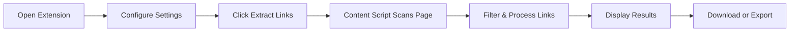

# Quick Doc Downloader Chrome Extension

<div align="center">


</br>


**Quickly extract, manage, and download document links from any webpage**

[Features](#-features) • [Installation](#-installation) • [Usage](#-usage) • [Configuration](#-configuration) • [Tools & Technologies](#-tools--technologies)

</div>

---

## Overview

**Quick Doc** is a fast and efficient Chrome extension designed to automatically discover, extract, and manage document links from web pages. Built with modern web technologies and optimized for enterprise use cases, particularly **Sitecore CMS environments**.

### 💡 Why Quick Doc?

Many developers, content managers, and professionals struggle with extracting document links from web pages. Whether you're:
- **Auditing content** on large websites with hundreds of documents
- **Migrating media** between CMS platforms (especially Sitecore)
- **Documenting assets** for compliance or inventory purposes
- **Bulk downloading** files without clicking each link manually
- **Exporting link data** to spreadsheets or HTML snippets

The manual process is tedious, error-prone, and time-consuming. **Quick Doc** was created to solve these pain points** - providing a one-click solution that handles all the complexity behind the scenes. No more copy-pasting URLs, manually filtering file types, or struggling with relative vs absolute paths. Just click, extract, and go!

### Key Highlights

- **Intelligent Link Detection** - Automatically finds document links using advanced CSS selectors
- **Multi-Format Support** - Supports PDF, DOC, DOCX, XLS, XLSX, PPT, PPTX, TXT, CSV, RTF, ODT and more
- **Bulk Operations** - Download multiple files or export data with a single click
- **Modern UI** - Beautiful navy-themed interface with gradient design
- **Fully Configurable** - Customizable selectors, prefixes, and extraction settings
- **Sitecore Optimized** - Built-in support for Sitecore media library paths

---

## Features

### Core Functionality

| Feature | Description |
|---------|-------------|
| **Smart Link Detection** | Automatically finds and extracts document links from any web page using configurable CSS selectors |
| **Multi-Format Support** | Supports PDF, DOC, DOCX, XLS, XLSX, PPT, PPTX, TXT, CSV, RTF, ODT and more |
| **Customizable Selectors** | Define custom CSS selectors to target specific link types (`a[href]`, `link[href]`, `a[data-href]`, etc.) |
| **Accurate File Sizing** | Intelligent file size detection from data attributes, parent elements, and page markup |
| **URL Processing** | Converts relative URLs to absolute URLs automatically |
| **Smart Filtering** | Automatically excludes navigation, header, and footer elements from extraction |

### Data Extraction

| Feature | Description |
|---------|-------------|
| **Title Extraction** | Captures link text, titles, aria-labels, and data attributes for better context |
| **Smart Filename Generation** | Creates clean, slugified filenames from URLs and metadata |
| **File Metadata** | Extracts file extension, size, and additional metadata automatically |
| **Comprehensive Search** | Searches parent elements, siblings, and hidden elements for file information |
| **Duplicate Handling** | Intelligent duplicate detection and filename collision resolution |

### Export & Download Options

| Feature | Description |
|---------|-------------|
| **Bulk Downloads** | Download all found documents with one click, with automatic duplicate skipping |
| **CSV Export** | Export link data to spreadsheet-friendly CSV format with comprehensive metadata |
| **HTML Snippet Generation** | Create ready-to-use HTML code for embedding links (Sitecore-optimized) |
| **Customizable Output** | Configure media prefixes and output formats for different environments |
| **Data Preservation** | Maintains all extracted data including duplicates for comprehensive reporting |

### Advanced Configuration

| Feature | Description |
|---------|-------------|
| **Persistent Settings** | All preferences are saved automatically using Chrome Storage API |
| **Custom CSS Selectors** | Target specific elements with custom selectors for complex page structures |
| **Inner Content Toggle** | Choose whether to include link text in exports |
| **Media Prefixes** | Configure custom prefixes for Excel and HTML exports |
| **File Extension Filtering** | Customize which file types to extract |

---

## How It Works

### Workflow



### Quick Start Guide

1. **Navigate** to any webpage containing document links (PDFs, Word docs, Excel files, etc.)
2. **Click** the Quick Doc extension icon in your Chrome toolbar
3. **Configure** your extraction settings (optional - defaults work for most cases):
   - Choose file extensions to extract (default: pdf, docx, xlsx, etc.)
   - Set media prefixes for Sitecore exports (if needed)
   - Adjust CSS selectors for complex pages
4. **Click** "Extract Links" to scan the current page
5. **Review** the extracted links in the results panel:
   - See total count and file sizes
   - Browse individual links with titles
   - Check for duplicates
6. **Download** files:
   - Click "Download Files" to download all found documents
   - Files are automatically saved with proper names
7. **Export** data:
   - Click "Export Data" to generate CSV and HTML files
   - CSV includes all metadata (URLs, titles, sizes, etc.)
   - HTML provides ready-to-use code snippets

### Step-by-Step Usage

**For Content Managers:**
- Extract all PDFs from a corporate website for auditing
- Generate HTML snippets for Sitecore CMS integration
- Export link inventory to Excel for documentation

**For Developers:**
- Bulk download assets during site migrations
- Extract document links from complex JavaScript-rendered pages
- Generate CSV reports for link validation

**For Sitecore Users:**
- Configure media prefixes to match your Sitecore structure
- Export links with proper media library paths
- Generate HTML snippets ready for Sitecore components

---

## Configuration Options

### File Extensions

Configure which file types to extract (comma-separated):

```
pdf, doc, docx, xls, xlsx, ppt, pptx, txt, csv, rtf, odt
```

### CSS Selectors

Target specific elements on pages:

```
a[href], link[href], a[data-href], a[data-download]
```

**Advanced Example:**
```
a[href*=".pdf"], .download-link, [data-file-type="document"]
```

### Media Prefixes

#### Excel Media Prefix
Used in CSV export for media constants:
```
media | /Sitecore/media files/Y/SiteName/Universal/investors/result-reports-presentation/
```

#### HTML Media Prefix
Used in HTML snippet generation:
```
/~/media/Files/Y/SiteName/Universal/investors/result-reports-presentation/
```

### Extraction Settings

| Setting | Description |
|---------|-------------|
| **Include Inner Content** | Extract link text and titles for better context in exports |
| **Make Absolute URLs** | Convert relative URLs to absolute URLs for reliable downloads |

---

## Export Formats

### CSV Export

The CSV export includes comprehensive columns:

| Column | Description |
|--------|-------------|
| `original_url` | The source URL of the document |
| `title` | Link text/title if available |
| `slugified_filename_with_ext` | Clean filename with extension |
| `slugified_filename_no_ext` | Clean filename without extension |
| `media_constant` | Prefixed filename for media systems (Excel format) |
| `media_constant_no_ext` | Prefixed filename without extension |
| `link_text` | Extracted link text content |
| `file_size_human` | Human-readable file size (B, KB, MB, GB) |
| `tooltip` | Descriptive tooltip text |
| `extension` | File extension |
| `status` | Extraction status |
| `is_duplicate` | Whether this is a duplicate URL |

### HTML Snippet

Generates ready-to-use HTML with:

- Bootstrap-compatible classes
- Accessibility attributes (`aria-label`, `title`)
- File size and type information
- `target="_blank"` for external links
- **Sitecore-optimized markup** with proper media library paths
- Semantic HTML structure

**Example Output:**
```html
<a href="/~/media/Files/Y/SiteName/Universal/investors/result-reports-presentation/example.pdf"
   title="PDF, 2.5 MB, opens in a new window"
   target="_blank"
   class="button-label align-items-center d-inline-flex text-decoration-none text-primary-1 pt-sm-2 pb-sm-2 ps-sm-3 pe-sm-3">
   <span class="icon icon-arrow-in-down"></span> Annual Report 2024
</a>
```

---

## Sitecore CMS Integration

This extension is specially optimized for **Sitecore CMS environments**:

### Sitecore-Specific Features

| Feature | Description |
|---------|-------------|
| **Media Library Path Recognition** | Automatically detects Sitecore media library URLs (`/sitecore/media library/...`) |
| **Media Prefix Configuration** | Built-in support for Sitecore media prefixes in exports |
| **Sitecore Asset Detection** | Recognizes common Sitecore document patterns and structures |
| **Clean URL Processing** | Handles Sitecore's URL parameters and media queries effectively |

### Sitecore Use Cases

- **Content Auditing** - Extract all downloadable assets from Sitecore pages
- **Media Migration** - Generate inventories of media library documents
- **Asset Documentation** - Create comprehensive lists of available downloads
- **Quality Assurance** - Verify document availability and metadata accuracy
- **Link Management** - Maintain consistent media library references

---

## Technical Features

### Smart File Size Detection

The extension uses multiple strategies to find exact file sizes:

1. **Data Attributes** - `data-size`, `data-filesize`, `data-bytes`, etc.
2. **Parent Element Analysis** - Scans parent elements for size information
3. **Sibling Element Scanning** - Checks adjacent elements for size data
4. **Aria-Label & Title** - Extracts size from accessibility attributes
5. **Hidden Elements** - Finds size information in hidden DOM elements
6. **Multiple Regex Patterns** - Supports various size formats (KB, MB, GB, TB, bytes)

### Filename Processing

- Automatic slugification for safe filenames
- Duplicate extension prevention
- Fallback filename generation
- Special character handling
- Unicode normalization (NFKD)
- URL-safe character conversion

### Duplicate Handling

- **URL Normalization** - Normalizes URLs for accurate duplicate detection
- **Filename Collision Resolution** - Automatically suffixes filenames when collisions occur
- **Download Optimization** - Downloads each unique URL only once
- **Export Preservation** - Maintains all occurrences in CSV/HTML exports for reporting

### Error Handling

- Graceful failure for inaccessible content
- Detailed error logging to console
- User-friendly error messages
- Automatic retry mechanisms
- Fallback strategies for edge cases

---

## Tools & Technologies

### Core Technologies

| Technology | Purpose | Version |
|------------|---------|---------|
| **JavaScript (ES6+)** | Core extension logic | ES2020+ |
| **Chrome Extensions API** | Browser integration | Manifest V3 |
| **CSS3** | Modern styling with gradients | CSS3 |
| **HTML5** | Extension UI structure | HTML5 |
| **SVG** | Scalable vector icons | SVG 1.1 |

### Chrome APIs Used

| API | Purpose |
|-----|---------|
| `chrome.tabs` | Access and manage browser tabs |
| `chrome.downloads` | Handle file downloads |
| `chrome.storage` | Persistent settings storage |
| `chrome.scripting` | Content script injection |
| `chrome.runtime` | Extension lifecycle management |
| `chrome.action` | Extension icon and popup management |

### Development Tools

| Tool | Purpose |
|------|---------|
| **Chrome DevTools** | Debugging and development |
| **Manifest V3** | Modern extension architecture |
| **Content Scripts** | Page content extraction |
| **Service Workers** | Background processing |
| **Chrome Storage API** | Settings persistence |

### Design & UI

| Element | Technology |
|---------|------------|
| **Icons** | Custom SVG icons (navy-themed) |
| **Styling** | CSS3 with gradients and animations |
| **Layout** | Flexbox and modern CSS Grid |
| **Colors** | Navy blue gradient (#132649 to #1E355E) |
| **Typography** | System fonts (San Francisco, Segoe UI, Roboto) |

### File Processing

| Feature | Implementation |
|---------|----------------|
| **CSV Generation** | Custom CSV escaping and formatting |
| **HTML Generation** | Template-based HTML snippet creation |
| **URL Parsing** | Native URL API with fallbacks |
| **Filename Slugification** | Custom regex-based slugification |
| **File Size Conversion** | Human-readable size formatting |

---

## Installation

### From Source

1. **Clone or Download** this repository
2. **Open Chrome** and navigate to `chrome://extensions/`
3. **Enable Developer Mode** (toggle in top-right corner)
4. **Click "Load unpacked"** and select the extension directory
5. **Pin the extension** to your toolbar for easy access

### Requirements

- Chrome 88+ (Manifest V3 support)
- Windows, macOS, or Linux
- Active internet connection (for downloading files)

---

## UI Design & User Experience

Quick Doc features a **modern, professional interface** designed for efficiency and ease of use:

### Visual Design

- **Navy Gradient Header** - Beautiful gradient background (#132649 to #1E355E) with white text for maximum contrast
- **Clean Layout** - Organized sections with clear visual hierarchy
- **Responsive Popup** - Optimized 420px width popup that fits perfectly in Chrome
- **Intuitive Controls** - Large, clearly labeled buttons with hover effects
- **Smooth Animations** - Subtle transitions and loading spinners for better UX
- **Results Display** - Clean, scrollable results panel with organized link listings

### UI Components

#### Header Section
- **Gradient background** with Quick Doc branding
- **Clear subtitle** explaining the extension's purpose
- **Professional typography** using system fonts

#### Settings Sections
- **Collapsible sections** for Basic Settings, Media Constants, File Extensions, and Advanced Settings
- **Checkbox controls** for quick toggles
- **Text inputs** with focus states and validation
- **Textarea fields** for multi-line configurations

#### Action Buttons
- **Primary button** (Extract Links) - Prominent navy gradient styling
- **Secondary buttons** (Download & Export) - Subtle styling, disabled until links are found
- **Hover effects** - Visual feedback on interactive elements
- **Disabled states** - Clear indication when actions aren't available

#### Results Panel
- **Summary card** showing total links found and file sizes
- **Scrollable link list** with individual link items
- **Color-coded information** - URLs in blue, titles in gray
- **Status indicators** - Loading spinner with text feedback

### Color Palette

```
Primary Navy:   #132649  (Header gradient start)
Secondary Navy: #1E355E  (Header gradient end)
Accent Blue:    #4facfe  (Focus states, accents)
Text Dark:      #2d3748  (Primary text)
Text Light:     #4a5568  (Secondary text)
Border:         #e2e8f0  (Input borders, dividers)
Background:     #f8f9fa  (Results background)
White:          #ffffff  (Main background)
```

### Typography

- **System Font Stack**: `-apple-system, BlinkMacSystemFont, 'Segoe UI', Roboto, sans-serif`
- **Responsive sizing**: 18px headers, 14px section titles, 12px body text
- **Font weights**: 600 for headings, 500 for labels, 400 for body

### Accessibility Features

- High contrast text and backgrounds
- Focus indicators on all interactive elements
- Clear labels for all form inputs
- Semantic HTML structure
- Keyboard navigation support
- Screen reader friendly markup

---

## Privacy & Permissions

### Required Permissions

| Permission | Purpose |
|------------|---------|
| `activeTab` | Read page content and extract links |
| `downloads` | Save files and export data |
| `storage` | Save user preferences |
| `scripting` | Inject content scripts |
| `<all_urls>` | Work on any website |

### Privacy Policy

- **No Data Transmission** - All processing happens locally in your browser
- **No Tracking** - No analytics or tracking scripts
- **No External Requests** - Except for downloading files you explicitly request
- **Local Storage Only** - Settings stored locally using Chrome Storage API

---

## Known Limitations

| Limitation | Workaround |
|------------|------------|
| Some websites may block content script injection | Use manual selector configuration |
| Complex JavaScript-generated links might not be detected | Wait for page to fully load before extracting |
| File size detection depends on page markup | Extension uses multiple fallback strategies |
| Large pages may take time to process | Progress indicators show extraction status |
| Some downloads may be blocked by browser security | Check browser download settings |

---

## Future Enhancements

### Planned Features

- [ ] Real-time file size verification via HEAD requests
- [ ] Progress indicators for large extractions
- [ ] Filter and search capabilities in results
- [ ] Custom export templates
- [ ] Integration with cloud storage services (Google Drive, Dropbox)
- [ ] Batch processing for multiple tabs
- [ ] Advanced link validation
- [ ] Custom filename patterns
- [ ] Export to JSON format
- [ ] Dark mode support
- [ ] Keyboard shortcuts
- [ ] Export history

---

## Troubleshooting

### Common Issues

**Issue**: Extension doesn't extract links
- **Solution**: Check that the page has fully loaded, verify CSS selectors match page structure

**Issue**: Downloads fail
- **Solution**: Check browser download permissions, verify URLs are accessible

**Issue**: File sizes show as "Unknown"
- **Solution**: File size detection depends on page markup; this is expected for some sites

**Issue**: Duplicate files in downloads
- **Solution**: Extension automatically skips duplicate URLs; check export for all occurrences

---

## Development

### Project Structure

```
quick-doc/
├── manifest.json          # Extension manifest (Manifest V3)
├── popup.html             # Extension popup UI
├── popup.css              # Styling for popup
├── popup.js               # Main extension logic
├── background.js          # Service worker (background script)
├── content.js             # Content script for page extraction
├── icons/                 # Extension icons
│   └── icon.svg
└── README.md              # This file
```

### Building from Source

1. Clone the repository
2. No build process required - extension works directly from source
3. Load unpacked extension in Chrome
4. Make changes and reload extension to test

---

## License

This project is licensed under the MIT License - see the LICENSE file for details.

---

## Author

**Viral Sachde**

- Extension: Quick Doc
- Version: 1.0.0
- Status: Production Ready

---

## Acknowledgments

- Built with modern Chrome Extensions API (Manifest V3)
- Optimized for Sitecore CMS environments
- Designed with user experience and performance in mind

---

<div align="center">

**Made with ❤️ by Viral Sachde**

Made for content managers and developers

[Report Bug](https://github.com/your-repo/issues) • [Request Feature](https://github.com/your-repo/issues) • [Documentation](#-overview)

</div>
